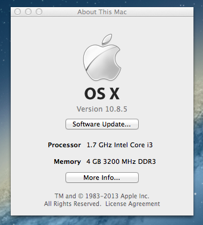
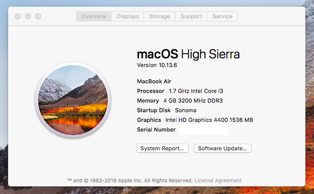
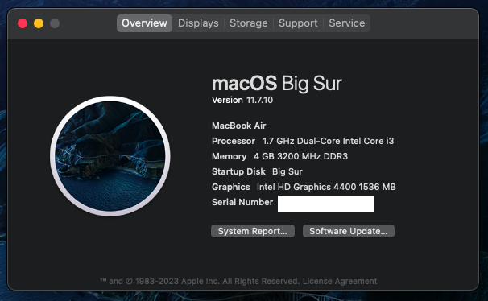
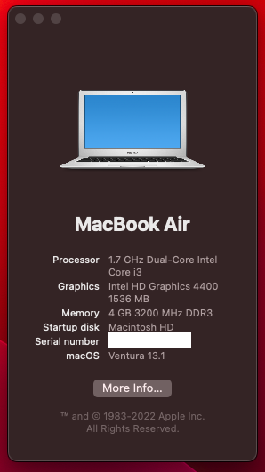

# Acer-C720-Hackintosh
Finally a real guide for running MacOS on the legendary Acer C720/C720p Chromebook (Peppy). 

| Mountain Lion | High Sierra | Big Sur | Ventura | Sonoma |
|------------|-------------|-------------|-------------|-------------|
|  |  | |  |

## Table of Contents

- [Disclaimer](#Disclaimer)
- [Tested MacOS Versions](#Tested-MacOS-Versions)
- [Specifications and Status](#Specifications-and-Status)
- [Installation](#Installation)
  - [Preliminary](#Preliminary)
  - [SSDT's](#SSDT's)
  - [Kexts](#Kexts)
  - [Plist Edits](#Plist-Edits)
- [OpenCore Legacy](#OpenCore-Legacy)
- [Credits](#Credits)

## ⚠️ Disclaimer ⚠️
**The process described in this guide may cause irreversible damage to your laptop. We accept absolutely no responsibility for the consequences of anyone electing to follow the instructions in this document, and make no guarantees about the quality or effectiveness of the software therein.**

**This guide is intended to be used on a self-service and reference basis only. It may become out of date or no longer updated at any time. It is up to you to find up to date information. We are not here to build your hackintosh for you. Please direct basic OpenCore and plist related questions to the official Dortania Discord or subreddit. NO SUPPORT WHATSOEVER will be given to those using preconfigued EFI's/plists, configurators, or Clover.**

**Feedback is always welcome. If you are interested in what a specific function does feel free to create a discussion.**

## Tested MacOS Versions

- MacOS X Mountain Lion (10.8)
- MacOS Yosemite (10.10) 
- MacOS El Capitan (10.11) 
- MacOS Sierra (10.12) 
- MacOS High Sierra (10.13)
- MacOS Mojave (10.14)
- MacOS Catalina (10.15)
- MacOS Big Sur (11)
- MacOS Monterey (12)
- MacOS Ventura (13)
- MacOS Sonoma (14)

## Specifications and Status

| Type | Model | Notes |
|----------|----------|----------|
| Processor | Intel Celeron 2955U/i3-4005U | Celeron 2955U Unsupported |
| Graphics | Intel HD 4000/4400 | Intel HD 4000 Unsupported |
| Memory | 2/4gb DDR3L | 4gb suggested for MacOS Mojave and later |
| Storage | 16gb/32gb M.2 2242 | Replaceable, NVME unsupported. 256gb+ suggested |
| WiFi | Atheros AR9462 | Supported on MacOS Big Sur and earlier (see notes) |
| Bluetooth | Atheros AR9462 | Supported on MacOS Big Sur and earlier (see notes) |
| Touchpad | Elan/Cypress | Cypress unsupported, ELAN only. |
| Display/Touchscreen | Atmel 1366x768 | Fully Supported |
| Sound/AUX | Realtek ALC283 | Fully Supported |
| Camera | 720p | Fully Supported |
| SD Card | | Fully Supported |

*The Wifi and BT on MacOS for Atheros cards is extremely buggy, regardless of version. Expect bugs if you enable it. No AirDrop or Handoff support. It is highly suggested to purchase a supported Intel or Broadcom Wifi/BT USB card but that is outside the scope of this guide. 

*Both Cypress and Elan touchpads are interchangable. You can often find the supported Elan touchpad on eBay and replace the unsupported Cypress model. [link](https://www.ifixit.com/Guide/Acer+Chromebook+C720-2827+Trackpad+Replacement/121918)

*You can also easily upgrade the low quality display to an [IPS unit](https://www.reddit.com/r/chrultrabook/comments/5krtpw/upgrade_the_c720p_or_c740_display/). There has been great success in adding a digitizer to the non touchscreen model as well.

## Installation 

### Preliminary
1. Flash Mr. Chromebox's [CoreBoot Firmware](https://mrchromebox.tech/). 
2. Build the base OpenCore EFI for [Haswell Laptops](https://dortania.github.io/OpenCore-Install-Guide/prerequisites.html/).
3. Dump your complete [DSDT](https://dortania.github.io/Getting-Started-With-ACPI/Manual/dump.html#:~:text=In%20command%20prompt%20run%20path%2Fto%2Facpidump.exe%20-b%20-n%20DSDT,DSDT%20as%20a.dat%20file.%20Rename%20this%20to%20DSDT.aml).

### SSDT's
| Kext | Notes | Download |
|----------|----------|----------|
| SSDT-Plug-Alt | Custom SSDT-Plug from 1Revenger1 fixing XCPM on Coreboot 4.20+ | [Link](https://github.com/bruceythegoosey/Acer-C720-Hackintosh/blob/main/Resources/SSDTs/SSDT-PLUG-ALT.aml)
| SSDT-EC | Made using SSDTTime | [Link](https://github.com/bruceythegoosey/Acer-C720-Hackintosh/blob/main/Resources/SSDTs/SSDT-EC.aml)
| SSDT-USBX | Made using SSDTTime | [Link](https://github.com/bruceythegoosey/Acer-C720-Hackintosh/blob/main/Resources/SSDTs/SSDT-USBX.aml)
| SSDT-HPET | Made using SSDTTime | [Link](https://github.com/bruceythegoosey/Acer-C720-Hackintosh/blob/main/Resources/SSDTs/SSDT-HPET.aml)
| SSDT-PNLF | Made using SSDTTime | [Link](https://github.com/bruceythegoosey/Acer-C720-Hackintosh/blob/main/Resources/SSDTs/SSDT-PNLF.aml)

*No need for SSDT-XOSI or SSDT-GPIO if using ELAN Touchpad.

### Kexts
| Kext | Notes | Download | 
|----------|----------|----------|
| Lilu || [Link](https://github.com/acidanthera/Lilu/releases) | 
| WhateverGreen || [Link](https://github.com/acidanthera/WhateverGreen/releases/tag/1.6.6) |
| VirtualSMC || [Link](https://github.com/acidanthera/VirtualSMC/releases) |
| SMCBatteryManager | VirtualSMC Satalite | [Link](https://github.com/acidanthera/VirtualSMC/releases) |
| SMCProcessor | VirtualSMC Satalite | [Link](https://github.com/acidanthera/VirtualSMC/releases) |
| SMCLightSensor | VirtualSMC Satalite | [Link](https://github.com/acidanthera/VirtualSMC/releases) |
| SMCSuperIO | VirtualSMC Fan Satalite (untested) | [Link](https://github.com/acidanthera/VirtualSMC/releases) |
| VoodooI2C || [Link](https://github.com/VoodooI2C/VoodooI2C/releases) |
| VoodooI2CELAN | VoodooI2C Satalite for ELAN Touchpad | [Link](https://github.com/VoodooI2C/VoodooI2C/releases) |
| VoodooI2CAtmelMXT | VoodooI2C Satalite for ATMEL Touchscreen | [Link](https://github.com/VoodooI2C/VoodooI2C/releases) |
| VoodooPS2Controller | Remove VoodooPS2Mouse and VoodooPS2Trackpad Plugins | [Link](https://github.com/acidanthera/VoodooPS2/releases/) |
| AppleALC | Realtek Speaker, AUX and HDMI Support | [Link](https://github.com/acidanthera/AppleALC/releases) |
| CrosEC | Embedded Controller Support (ECTool unsupported on High Sierra and older) | [Link](https://github.com/Chromeintosh/CrosEC/releases) |
| HS80211Family | Wifi Injection for MacOS 10.13-11.0 DO NOT USE on Monterey and newer or High Sierra and older | [Link](https://github.com/qiqco/Atheros-Wi-Fi-Hackintosh-macOS/blob/main/HS80211Family.kext.zip) |
| Atheros40 | Wifi Injection for MacOS 10.13-11.0 DO NOT USE on Monterey and newer or High Sierra and older | [Link](https://github.com/qiqco/Atheros-Wi-Fi-Hackintosh-macOS/blob/main/AirPortAtheros40-AR9462.zip) |
| Ath3kBT | Bluetooth Injection for MacOS 10.8-11.0 DO NOT USE on Monterey and newer (HS unsupported) | [Link](https://github.com/zxystd/AthBluetoothFirmware/releases/tag/v1.1.0) |

*Need a project? Ath3kBT needs Airport and Handoff functionallity. The original author had some ideas about a patch [here](https://github.com/zxystd/AthBluetoothFirmware/issues/3#issuecomment-813152300). 

*Need a project? The original Cypress driver from CoolStar needs ported from the original VoodooI2C to a Voodoo Satalite.

*Disable Duplicate CFBundleIdentifiers in ProperTree

### Plist Edits
| Type | Key | Link | Notes |
|----------|----------|----------|----------|
| HPET and IRQ patches | `ACPI -> Patch` | [Link](https://github.com/bruceythegoosey/Acer-C720-Hackintosh/blob/main/Resources/Plists/ACPI%20Patches.plist) | Brightness patches and IRQ Conflicts |
| MATs Firmware | `Booter -> Quirks` | [Link](https://github.com/bruceythegoosey/Acer-C720-Hackintosh/blob/main/Resources/Pictures/WriteUnprotector.png) | Coreboot supports MATs. No need to use EnableWriteUnprotector (disable MATs on High Sierra and lower) |
| iGPU Framebuffer / Audio | `DeviceProperties -> Add` | [Link](https://github.com/bruceythegoosey/Acer-C720-Hackintosh/blob/main/Resources/Plists/DeviceProperties.plist) | Adds iGPU properties, speaker and HDMI/Headphone support. |
| Generate SMBIOS | `PlatformInfo-Generic` | [Link](https://dortania.github.io/OpenCore-Install-Guide/config-laptop.plist/haswell.html#platforminfo) | MacBookAir6,1, MacBookAir6,2 or MacBookPro11,2 suggested |
| SecureBootModel | `Misc-Security` | [Link](https://dortania.github.io/OpenCore-Post-Install/universal/security/applesecureboot.html#what-is-apple-secure-boot) | 10.8-10.12: `Disabled` 10.13-10.15: `j137` 11-14:  `Default` (See OCLP Notes) |

* In DeviceProperties `Acpi-wake-type` fixes an issue where the keyboard freezes but only on MacOS 11+. It does not seem to work on MacOS 10.15 and earlier, use accordingly. 
* ApECID seems to have issues on this device. You're on your own if you wish to achieve "Full Security."

## OpenCore Legacy
Running MacOS Sonoma on a Haswell laptop is not a bright idea, but is indeed possible. 

Guide Coming Soon

## Credits and Thanks
[Acidanthera](https://github.com/acidanthera/OpenCorePkg) for OpenCorePkg and kexts 

[Isi95010](https://github.com/isi95010) for his chromebook and countless hours of debugging and research.

[CoolStar](https://github.com/coolstar) for [original](https://coolstar.org/chromebook/macos.html) hackintosh port, driver work and inspiration.

[Meghan6](https://github.com/meghan06) for documentation assistance, proofreading and Github setup. 

[1Revenger1](https://github.com/1Revenger1) for CrosEC, VoodooI2C/SSDT help and incredible patience.

[Chrultrabook Team and Contributers](https://docs.chrultrabook.com) for general help and debugging

[Olm3ca](https://github.com/olm3ca/PixelbookOSX) for guide template and inspiration. 

[Bruceythegoosey](https://github.com/bruceythegoosey) yours truly
